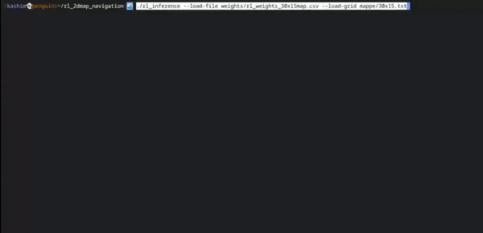

# Autonomous Navigation Reinforcement Learning Network (Rete di Rinforzo per la Navigazione Autonoma)

[English](README.md) | [Italiano](README.it.md)

---

## English

### Project Overview

This project presents a **Reinforcement Learning system designed for autonomous navigation in complex environments with obstacles**. It utilizes a small feed-forward neural network and an epsilon-greedy agent to find optimal paths from a starting point to a destination.

A key highlight is the **practical demonstration with a small ESP8266-based robot**, programmed using the Arduino environment, offering a tangible example of the system's capabilities.

Developed in C++ with minimal dependencies, the code is designed to be **easy to understand and use**, making it ideal for educational purposes and practical learning.

### Features

* **Reinforcement Learning Agent:** Small feed-forward network with an epsilon-greedy policy.
* **Pathfinding:** Optimal path determination in grid-based environments.
* **Low Dependencies:** Primarily C++ with minimal external libraries.
* **Educational Focus:** Clean and understandable code suitable for learning.
* **Hardware Integration:** Example implementation with an ESP8266 robot.

### Demos

* **Inference with Bash Simulation:**
    

* **Inference with HTTP Communication to Robot:**
    

    ```bash
    ./rl_inference --load-file weights/rl_weights_10x10map_simple.csv --load-grid maps/10x10s.txt --ip-esp 192.168.1.132 --step-lin 450 --step-rot 1100
    ```

    *Note: More examples are available in the `weights` folder along with their corresponding maps.*

### Dependencies

* `eigen3` (On Debian/Ubuntu: `sudo apt install libeigen3-dev`)
* `curl` [Optional, only for ESP8266 example] (On Debian/Ubuntu: `sudo apt install libcurl3-gnutls`)

### Getting Started

#### Compilation

To compile the project, use the provided Make targets:

* `make train` - Compiles the training application.
* `make inference` - Compiles the inference application.
* `make map` - Compiles the map creation tool.

#### Creating Maps

Before training, you need to create a map for your environment. Use an image editor (e.g., GIMP) to draw a small map.

* **Map Guidelines:**
    * **Max Size:** Do not exceed 30x30 pixels.
    * **Background:** Black.
    * **Obstacles:** White.
    * **Robot Start:** Green.
    * **Target Destination:** Red.
* **Processing:** Save your image (e.g., `12x20map.png`) and then process it with the `create_map` command to generate a text-based grid representation:

    ```bash
    ./create_map maps/12x20map.png > 12x20.txt
    ```

    This command generates a 2D array representing the map with obstacles, start, and end points, which will be passed to the `--load-grid` parameter.

    **Example Map Representation (Text File):**
    ```
    1 1 0 0 0
    3 1 2 0 0
    0 1 1 0 0
    0 0 1 1 0
    0 0 0 0 0
    ```

    **Some Map Examples (Images):**
    <table>
      <tr>
        <td> </td>
     <td> </td>
     <td> </td>
     <td> </td>
     <td> </td>
     <td> </td>
     <td> </td>
     <td> </td>
     <td> </td>
      </tr>
    </table>

#### Training the Model

Train your Reinforcement Learning model using the `rl_train` command:

```bash
./rl_train --save-file rl_weights_5x5map.csv --load-grid maps/5x5.txt --num-epochs 5000
```

* **--save-file**: Path to save the trained weights.
* **--load-grid**: Path to your generated map file.
* **--num-epochs**: Number of training epochs.

#### Running Inference

Once trained, you can run inference to see the robot navigate:

```bash
./rl_inference --load-file rl_weights_5x5map.csv --load-grid maps/5x5.txt
```

* **--load-file**: Path to the trained weights file.
* **--load-grid**: Path to the map file used for inference.


Running Inference with ESP8266 Robot (HTTP Communication)

To demonstrate with the ESP8266 robot via HTTP:

```bash
./rl_inference --load-file weights/rl_weights_18x15map.csv --load-grid maps/18x15.txt --step-lin 2500 --step-rot 1000 --ip-esp '192.168.1.132'
```

* **--step-lin**: Linear movement steps for the robot.
* **--step-rot**: Rotational movement steps for the robot.
* **--ip-esp**: IP address of your ESP8266 robot.


You can use the 3D parts from this project for the example robot.
<a href="https://github.com/kashimAstro/esp8266_A_star">https://github.com/kashimAstro/esp8266_A_star</a>
