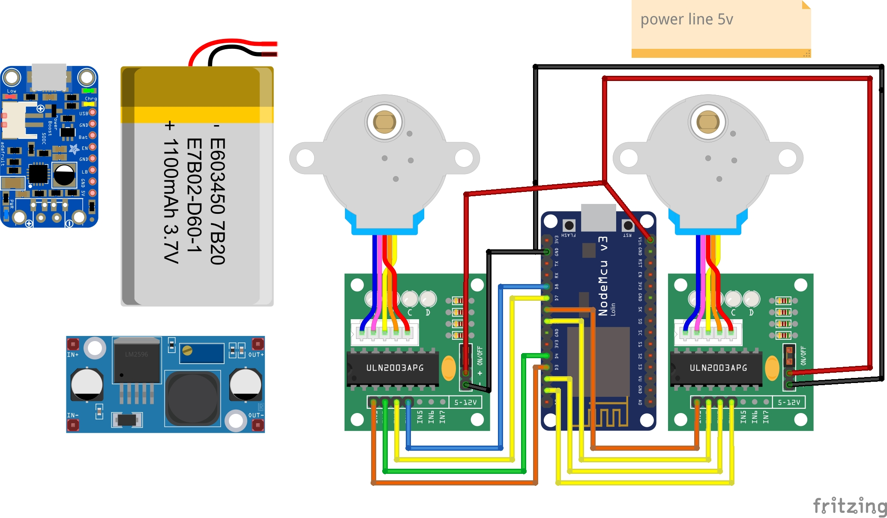

dipendenze:
	AccelStepper

scheme sample:

usb:
./arduino-cli compile --verify --upload -p /dev/ttyUSB0 --fqbn esp8266:esp8266:nodemcu  Arduino/arduino-esp8266/ -v

ota:
./arduino-cli compile --verify --upload --protocol network --port  192.168.1.132 --fqbn esp8266:esp8266:nodemcu Arduino/arduino-esp8266/ -v
